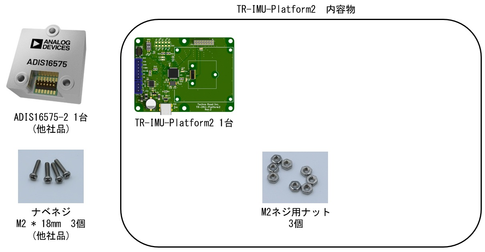
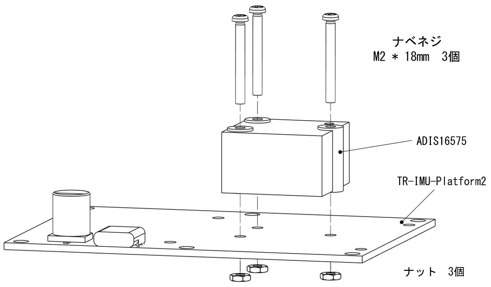
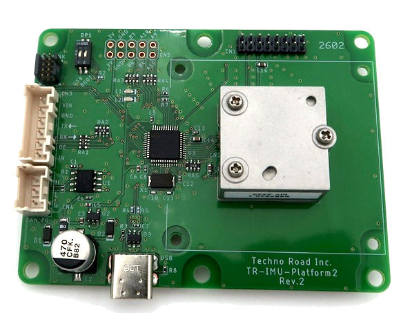

TR-IMU-Platform2　ADIS16575-2取り付けマニュアル

# 改訂履歴

| 版数 | 日付 | 変更内容 |
|---|---|---|
| 1 | 2026/06/30 | 新規作成 |

# はじめに
このマニュアルではTR-IMU-Platform2にアナログデバイセズ社のADIS16575-2の取り付け方法を記述します。

## 必要な物品
### 物品リスト
- TR-IMU-Platform2
- ADIS16575-2 （他社品）
- ステンレスなど非磁性のネジ M2 * 18mm　3個 （他社品）

### 参考画像

# 組み立て手順

## 組立

## 完成

---

Copyright (c) 2026 株式会社テクノロード
法令上認められる引用等を除き、当社の許可なく本資料の全部または一部を転載、複製、使用することはできません。

問い合わせ先
株式会社テクノロード
電話: 03-3440-6707
メール: post@techno-road.com
