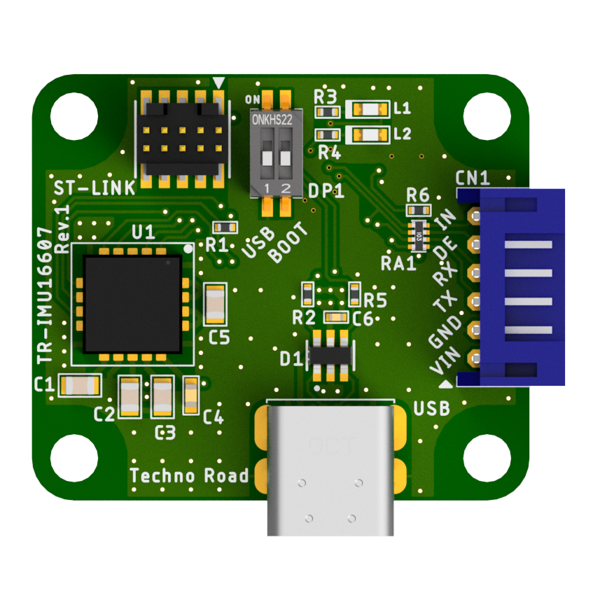
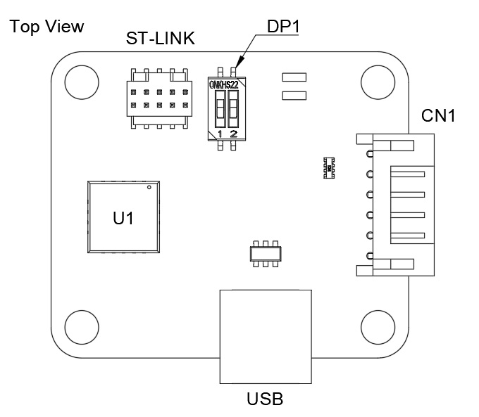
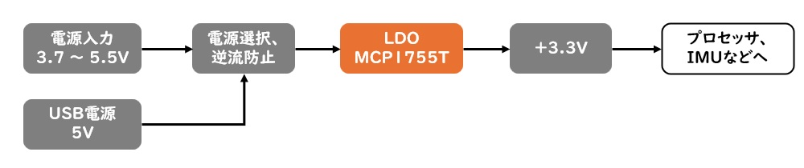
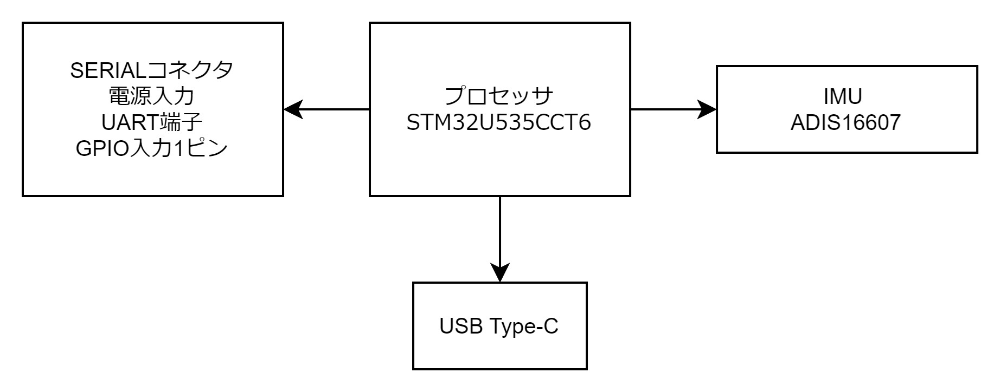
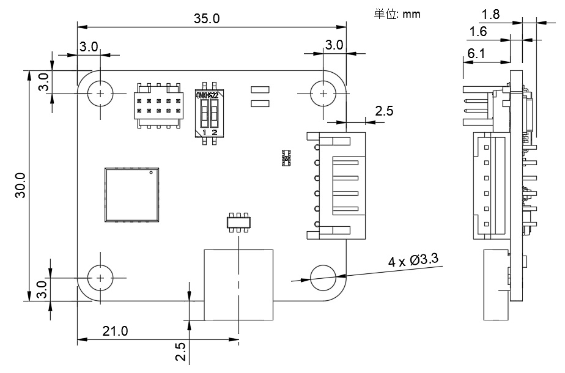

TR-IMU16607 ハードウェアマニュアル

# 改訂履歴

| 版数 | 日付 | 変更内容 |
|---|---|---|
| 1 | 2026/06/30 | 新規作成 |

# はじめに

このたびは `TR-IMU16607` をご利用いただき、ありがとうございます。  
本書は、`TR-IMU16607` のハードウェア仕様、各部名称、接続方法および取り扱い上の注意事項についてまとめたマニュアルです。ご使用の前に本書をお読みいただき、内容をご理解のうえ正しくお取り扱いください。

`TR-IMU16607` は、評価・開発用途での利用を想定した製品です。研究開発および評価を目的とした環境でご使用いただき、運用にあたっては周辺機器や接続先装置を含めた安全性を十分にご確認ください。

また、本書に記載している内容および製品仕様は、改良のため予告なく変更される場合があります。ご利用の際は、対象製品の版数や関連資料をあわせてご確認ください。

## 取り扱い上の注意

本製品は、評価・研究開発用途を想定した製品です。量産品、業務運用設備、または長期連続運用を前提とした用途で使用する場合は、お客様の責任において十分な評価を行ってください。

本製品には、民生用の一般電子部品を使用しています。宇宙、航空、医療、原子力、運輸、交通、各種安全装置など、人命や重大事故に関わる用途、または特別な品質・信頼性が要求される用途では使用しないでください。

次のような環境では使用しないでください。

- 極端な高温または低温の環境
- 振動や衝撃の激しい環境
- 水中、高湿度、結露が発生する環境
- 油分の多い環境
- 腐食性ガス、可燃性ガスが存在する環境
- 強い電気的ノイズが発生する環境

基板の表面を水で濡らしたり、金属に接触させた状態で電源を投入しないでください。また、定格を超える電源電圧を加えないでください。故障、発熱、発煙、発火の原因となる場合があります。

使用中に発煙、発火、異常な発熱、異臭などの異常が発生した場合は、直ちに電源を切り、使用を中止してください。

本書に記載される製品、ソフトウェア、技術情報のうち、「外国為替及び外国貿易法」に定める規制貨物または規制技術に該当するものを輸出、または国外へ持ち出す場合は、同法に基づく輸出許可が必要となる場合があります。

## 保証について

本製品の保証は、初期不良交換のみとします。万一、初期不良が確認された場合は、製品到着後 30 日以内に弊社までご連絡ください。不良品と引き換えに交換品をお届けします。

お客様都合による返品については、未使用品に限り対応します。この場合、返送料はお客様のご負担となります。

本製品の使用により事故、損害、データの損失、またはその他の不利益が発生した場合でも、弊社は一切の責任を負いません。

次の場合は、保証の対象外となります。

- 本製品の仕様範囲を超える条件で使用された場合
- 本製品を改造、分解、または修理した場合
- 誤接続、誤配線、過電圧、静電気、外部要因などにより故障した場合
- 他社製品との接続互換性、相性問題、または接続先機器に起因する問題が発生した場合

## 本文書について

本書に記載する内容および関連するソフトウェア、図面、資料に関する権利は弊社に帰属します。弊社の許可なく、本書の全部または一部を複製、改変、転載、配布することはできません。

## 商標について

本書に記載されている会社名、製品名、規格名は、それぞれ各社の商標または登録商標です。

## 機能
- プロセッサ：STM32U535CCT6  
アーキテクチャ：Cortex-M33 32-bit RISC コア、Single FPU内蔵  
クロック：160MHz

- IMU
  - アナログ・デバイセズ社 `ADIS16607` を基板上に実装
  - IMU 制御用に `SPI2`、`ADIS_RST`、`ADIS_DR`、`ADIS_SYNC` を接続

- ハードウェア機能
  - 定格電源電圧：3.7V ～ 5.5V DC
  - 通信/電源兼用USBコネクタ：USB Type-C
  - 電源供給/UART通信用コネクタ：CN1

- 通信インタフェース
  - `USB2.0` / `Full-Speed`（12Mbps）通信に対応
  - `UART` 通信に対応

- デバッグ/保守
  - `ST-LINK/V3` 用のデバッグコネクタを搭載
  - ブートモード切替用 DIP スイッチを搭載
  - ブートモード時に USB 経由でファームウェアの書き込みが可能

- 表示
  - 動作表示用 LED を 2 系統搭載

## 推奨動作条件
### 温度

| Symbol | 説明 | Min | Max |
|--------|------|-----|-----|
| - | 安全マージンを見込んだ基板全体の熱限界 | -40℃ | 85℃ |

> ※注意：部品のデータシートから抜き出した値です。厳密な調査はされていません。

---

### 絶対最大定格

下表は、機器の破損を避けるために超えてはならない上限値です。通常動作は下記の「電源条件」の範囲内で使用してください。

| Symbol | 説明 | Max |
|--------|------|-----|
| VIN_MAX | 基板入力電圧の絶対最大値 | 5.5V |

### 電源条件

| Symbol | 説明 | Min | Typ | Max |
|--------|------|-----|-----|-----|
| VIN | 基板入力電圧（USB VBUS または CN1） | 3.7V | 5.0V | 5.5V |
| VDD_3V3 | 基板内部ロジック電源 | 3.2V | 3.3V | 3.4V |

### 消費電流

`TR-IMU16607` について、[Power Profiler Kit II](https://akizukidenshi.com/catalog/g/g131258/) で確認した消費電流の目安は以下の通りです。

- 基本値: 約 `35mA`
- `USB` 使用時: 約 `+5mA`
- `UART` 使用時: 約 `+2mA`

`TR-IMU16607` は `CAN FD` 非対応です。

### デジタルI/O条件

本基板のマイコンおよび外部インタフェースのロジックレベルは 3.3V 系です。  
`CN1`、`ST-LINK` に接続されるデジタル信号は、3.3V ロジックを前提として使用してください。

5V 系信号をマイコンの GPIO へ直接入力しないでください。外部回路を接続する場合は、必要に応じてレベル変換回路を使用してください。ただし、`CN1` の `Pin 6` に引き出している `PB10` は 3.3V / 5V 入力に対応しています。

### コネクタごとの電圧条件

| Ref. | 電源 / 信号レベル | 注意事項 |
|---|---|---|
| CN1 | 5V 電源入力、3.3V UART ロジック | Pin1 は電源、Pin3/4 は 3.3V UART |
| ST-LINK | 3.3V ロジック | SWD デバッグ用 |
| USB | 5V VBUS、USB2.0 信号 | USB Type-C デバイス側 |

# 機能概要
## 基板構成

| Ref. | 説明 |
|------|------|
| U1 | ADIS16607 IMU |
| CN1 | 電源供給・UART通信コネクタ |
| USB | USB Type-C 電源供給と通信用 |
| ST-LINK | ST-LINK/V3 用デバッグコネクタ |
| DP1 | 設定用2ピンDIPスイッチ |

## プロセッサ

STM32U535CCT6 は Arm Cortex-M33 コアを最大 160 MHz で動作し、浮動小数点ユニット（FPU）と DSP 命令による高速な数値演算が可能です。低消費電力設計で、IMU データ処理や通信処理を伴う組み込み用途に適しています。

## 電源の接続図

## 基板の構成図

# ハードウェアの詳細
## IMU

本基板は、アナログ・デバイセズ社 `ADIS16607` をオンボードで実装しています。IMU はマイコンと `SPI2` で接続され、`ADIS_RST`、`ADIS_DR`、`ADIS_SYNC` 信号を用いて初期化およびデータ取得を行います。

### IMU主要接続信号

詳細な配線は回路図を参照してください。ここでは、`ADIS16607` とマイコンを接続する主な信号のみを示します。

| IMU ピン番号 | 信号名 | MCU側 | 説明 |
|---|---|---|---|
| 1 | ADIS_nRST | PA3 | IMU リセット信号 |
| 2 | SPI2_SCK | PB13 | SPI クロック |
| 4 | SPI2_MISO | PB14 | SPI データ出力 |
| 5 | ADIS_SYNC | PB0 | IMU 同期信号 |
| 6 | SPI2_MOSI | PB15 | SPI データ入力 |
| 7 | ADIS_DR | PB1 | データレディ信号 |
| 8 | SPI2_NSS | PB12 | SPI チップセレクト |

## CN1: 電源供給・UART通信コネクタ

`CN1` は、外部電源入力および UART 通信に使用する 6 ピンコネクタです。`UART4` の送受信信号に加え、補助機能としてRS485のデータイネーブル信号と、GNSSのPPS信号入力を想定した `Pin 6` の信号線が引き出されています。

UART 通信条件は `921600 bps`、`8N1` です。  
通信プロトコルの詳細は別紙の通信仕様書を参照してください。

また、`Pin 6` の `PB10` は 3.3V / 5V 入力に対応しています。

### CN1 ピンアサイン

※ピン番号は各コネクタの仕様書における端子番号に準拠しています。

| Pin | 信号名 | 説明 |
|---|---|---|
| 1 | +5V | 外部電源入力 |
| 2 | GND | グラウンド |
| 3 | PA0 / UART4_TX | UART 送信 |
| 4 | PA1 / UART4_RX | UART 受信 |
| 5 | PB2 / RS485_DE | RS485 データイネーブル |
| 6 | PB10 | GNSS の PPS 信号入力 |

### CN1 適合コネクタ

- 基板側コネクタ型番: `S6B-PH-K-S`
- 嵌合先（ケーブル側）ハウジング: `PHR-6`
- 嵌合先（ケーブル側）コンタクト: `BPH-002T-P0.5S`

`CN1` は `PH` シリーズの `6極 / 2.0mmピッチ` です。  
外部電源 / UART 通信用のケーブルを製作する場合は、上記の嵌合先ハウジングとコンタクトを使用してください。

## USB: USB Type-C コネクタ

`USB` は、電源供給および USB 通信用の USB Type-C コネクタです。USB2.0 Full-Speed 通信に対応し、基板への主電源入力としても使用できます。

電源ラインには保護ダイオード、ポリスイッチ、LDO レギュレータを実装しており、USB から入力された 5V を基板内で 3.3V に変換して使用します。`D+` / `D-` ラインには ESD 保護素子と直列抵抗を配置しています。

### USB 端子信号

| 端子 | 信号名 | 説明 |
|---|---|---|
| A1, A12, B1, B12 | GND | グラウンド |
| A4, A9, B4, B9 | VBUS | USB 5V 電源入力 |
| A5 | CC1 | 5.1kΩプルダウン接続 |
| B5 | CC2 | 5.1kΩプルダウン接続 |
| A6, B6 | D+ | USB データプラス |
| A7, B7 | D- | USB データマイナス |

## ST-LINK: デバッグコネクタ

`ST-LINK` は、SWD デバッグおよび書き込みに使用するコネクタです。

### ST-LINK ピンアサイン

※ピン番号は各コネクタの仕様書における端子番号に準拠しています。

| Pin | 信号名 | 説明 |
|---|---|---|
| 1 | VCC | ターゲット電圧 |
| 2 | SWDIO | SWD データ |
| 3 | GND | グラウンド |
| 4 | SWCLK | SWD クロック |
| 5 | GND | グラウンド |
| 6 | SWO | トレース出力 |
| 9 | GND | グラウンド |
| 10 | RESET | リセット信号 |

## DP1: 設定用 2 ピン DIP スイッチ

`DP1` は、基板の起動設定や設定読み取り用入力を切り替えるための 2 連 DIP スイッチです。  

- `PB3/DI` はONにすると、USB 通信を強制的にオンにすることができます。この機能がある事で、アプリ設定で USB 通信をオフにしている場合でも、`PB3/DI` をONにすることで USB 通信を有効化できます。

- `BOOT0` 側を ON にすると、マイコンのブートモードがシステムメモリからの起動に切り替わります。これにより、USB 経由でファームウェアの書き込みが可能になります。

### DP1 ピンアサイン

| Pin | 信号名 | 説明 |
|---|---|---|
| 1 | PB3 / DI | OFF:USB通信の設定次第、ON:USB通信を強制オン |
| 2 | BOOT0 | OFF:通常起動、ON:ブートモード |

# 機械情報
## ボードの外形と取付穴

基板外形は 35.0 mm x 30.0 mm です。
取付穴は 4 箇所あり、穴径は φ3.3 mm です。
表面の部品高は約6.1mm、基板厚は約1.6mm、裏面の部品高は2.0mm未満と見積もってください。

## コネクタ型番と嵌合先

| Ref. | 用途 | 基板側コネクタ型番 | 嵌合先（ハウジング / コンタクト） |
|---|---|---|---|
| CN1 | 電源供給 / UART | S6B-PH-K-S | PHR-6 / BPH-002T-P0.5S |
| ST-LINK | デバッグ | FTSH-105-01-L-DV-K-TR | - |
| USB | USB Type-C | USB4085-GF-A | - |

---

Copyright (c) 2026 株式会社テクノロード
法令上認められる引用等を除き、当社の許可なく本資料の全部または一部を転載、複製、使用することはできません。

問い合わせ先
株式会社テクノロード
電話: 03-3440-6707
メール: post@techno-road.com
