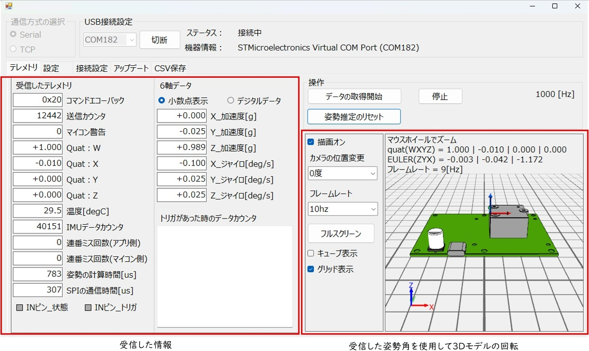
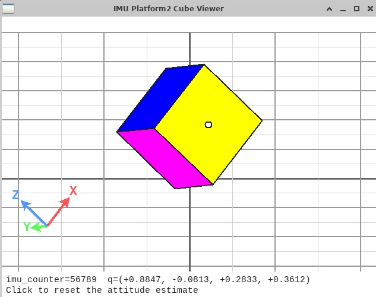

TR-IMU2基板共通 アプリケーションマニュアル

# 改訂履歴

| 版数 | 日付 | 変更内容 |
|---|---|---|
| 1 | 2026/06/30 | 新規作成 |

# はじめに

本書は、`TR-IMU-Platform2` および `TR-IMU16607` のアプリケーションマニュアルです。  
対象基板のソフトウェア構成、通信の考え方、弊社公開アプリケーションによる評価・動作確認方法、通信仕様に基づく直接利用方法をまとめています。

`TR-IMU-Platform2` と `TR-IMU16607` は同一のファームウェアを使用します。  
そのため、本書では両者をまとめて扱い、必要な箇所だけ基板ごとの差分を記載します。

詳細なハードウェア仕様、通信フレームの完全定義、組み込み開発向けの実装詳細は、関連資料を参照してください。

ROS2 ドライバの利用方法は、`TR-IMU2基板共通_ROS2ドライバマニュアル.md` を参照してください。

# 製品概要

## 対象製品

| 項目 | TR-IMU-Platform2 | TR-IMU16607 |
|---|---|---|
| 基板の位置づけ | 対応済みの ADI 製 IMU 評価ボードを搭載して使うプラットフォーム基板 | `ADIS16607` をオンボード搭載した基板 |
| ファームウェア | 共通 | 共通 |
| 通信IF | USB / UART / CANFD（FDフレーム専用） | USB / UART |
| 代表用途 | 各種IMUの評価、柔軟なシステム組み込み | 小型・固定構成での組み込み利用 |
| ハードの拡張性 | 外部機器接続用 GPIO（6ピン利用可能） | なし |
| 電源安定化 | バルクコンデンサ（470uF）搭載 | 最小構成 |

## 特徴

- 1kHz 周期で IMU データを取得し、上位へ送信できます。
- 上位PCは姿勢推定用の四元数とIMUの生データを同時に出力できます。
- `TR-IMU-Platform2` は USB、UART、CANFD のいずれからも制御できます。`TR-IMU16607` は USB、UART から制御できます。
- 上位PCからコマンドで動作開始、停止、姿勢リセット、各種設定変更ができます。
- `TR-IMU-Platform2` と `TR-IMU16607` は同一ファームウェアで運用できます。

### 6軸 IMU による姿勢推定の特性

本基板の姿勢推定は、ジャイロと加速度を用いる 6軸 IMU を前提としています。

- 地磁気センサを使用しないため、モータ、磁石、鉄材、電流配線などによる磁気外乱の影響を受けにくく、磁場環境が安定しない場所でも扱いやすいことが特長です。
- 一方で、地磁気による方位補正を行わないため、重力方向から観測できない水平面内の向き、すなわちヨー軸まわりの姿勢は絶対的に補正できません。
- 長時間連続して使用する場合は、ジャイロのバイアスや積分誤差により、ヨー角のずれが徐々に蓄積します。
- 長時間動作でヨー方向の絶対姿勢が必要な場合は、ROS などの上位システムで、GNSS、車輪オドメトリ、外部方位センサなど他のセンサ情報とフュージョンして補正することを推奨します。

## 想定する利用形態

1. 弊社が無償公開する PC アプリ `TR-IMU2-Monitor` で評価・動作確認を行う
2. 通信仕様に基づいて上位ソフトウェアから USB / UART / CANFD で直接コマンド送信する
3. ROS2 ドライバ経由で ROS2 環境から利用する
4. 必要に応じて開発・保守用途でファームウェアや設定値を確認する

必要に応じて、Python テストアプリ `TR-IMU2-PythonTestApp` により `USB` や `CAN FD` の通信確認も行えます。

# ソフトウェアの概要

## 全体構成

本基板のソフトウェアは、主に以下の処理ブロックで構成されます。

| ブロック | 役割 |
|---|---|
| IMU 制御 | SPI を用いて IMU から加速度、角速度、サンプルカウンタなどを取得 |
| 姿勢推定 | 取得した IMU データから姿勢四元数を計算 |
| 通信制御 | USB / UART / CANFD からのコマンド受信、応答電文送信 |
| 設定管理 | 通信IF、データ幅、姿勢推定フィルタ、重力補正などの設定保持 |
| 保守機能 | 再起動、DFU 起動、設定保存、設定初期化 |

## 基本動作

- 通常時は、上位PCからコマンドを受信すると応答を返します。
- 定期送信開始コマンドを受けると、1kHz 周期で動作用応答を連続送信します。
- 定期送信中でもコマンドは受け付けます。
- 姿勢リセットコマンドにより、姿勢推定四元数を初期化できます。

## 起動後の処理イメージ

1. 電源投入
2. マイコン初期化
3. 設定値読込
4. IMU 初期化と、対応した型番であるか確認
5. IMUへサンプル周期に関わる同期信号を出力開始
6. IMUの更新データを取得し、姿勢推定の周期処理開始
7. 通信待受開始
8. 必要に応じて定期送信開始

## 1kHz 周期処理の考え方

1ms ごとの周期で、概ね以下の順で処理されます。

1. IMUからData Ready割込みを受ける
2. IMU の更新データを取得
3. 加速度、角速度、サンプルカウンタなどを整形
4. 姿勢推定を実行
5. 必要なら送信用データを更新
6. 定期送信中なら上位PCへ応答電文を送信

## 基板識別と共通ファームウェア

設定用応答には `board`、`model`、`product_id` などの情報が含まれます。

| 項目 | 型番 |
|---|---|
| `product_id = 16575` | ADIS16575 |
| `product_id = 16607` | ADIS16607 |

同じ通信仕様であっても、搭載IMUや基板種別により取得値の意味や感度は異なるため、上位アプリは設定用応答を一度取得してから動作条件を確定することを推奨します。

# 通信とデータの考え方
以下説明はUSB 仮想 COMとUART向けの説明です。CANFDは別途仕様書を参照してください。

## 通信インタフェース

| 項目 | 内容 |
|---|---|
| USB | USB2.0 Full-Speed、仮想 COM として使用 |
| UART | `921600 bps`、`8N1` |
| CANFD | CAN 2.0 非対応、CANFD フレームで送受信 |

## フレームの基本構成

通信フレームは以下の形式です。

| 項目 | 内容 |
|---|---|
| Header | `0xAAAA` |
| Command ID / Response ID | コマンド種別 |
| Length | Data 長 |
| Data | パラメータ本体 |
| Checksum | 16bit チェックサム |

詳細なチェックサム計算方法、各バイト位置、定義値は通信仕様書 を参照してください。

## コマンドの分類

| 分類 | 主なコマンド |
|---|---|
| 動作コマンド | 応答取得、定期送信開始、定期送信停止、姿勢リセット |
| 設定コマンド | 設定取得、設定保存、通信IF設定、データ幅設定、フィルタ設定 |
| オプションコマンド | 再起動、DFU 起動 |

## 最低限使用するコマンド

| コマンドID | 名称 | 用途 |
|---|---|---|
| `0x30` | 応答取得 | 現在の動作データを1回だけ取得 |
| `0x31` | 定期送信開始 | 1kHz 定期送信の開始 |
| `0x32` | 定期送信停止 | 1kHz 定期送信の停止 |
| `0x33` | 姿勢リセット | 姿勢推定値の初期化 |
| `0x70` | 設定取得 | 現在設定と基板情報の取得 |
| `0x71` | 設定保存 | 現在設定の不揮発保存 |

## 動作用応答に含まれる主なデータ

| 項目 | 内容 |
|---|---|
| `quat_w/x/y/z` | 姿勢四元数 |
| `acc_x/y/z` | 加速度生データ |
| `gyro_x/y/z` | 角速度生データ |
| `temperature` | IMU 温度 |
| `imu_counter` | IMU 更新カウンタ |
| `imu_dropped` | IMU データ欠落回数 |
| `timestamp` | マイコン内部タイムスタンプ(us) |

## 上位アプリでの扱い方

- 受信直後は `mcu_error` のbit4を確認してください。
- 定期送信中は `imu_counter` の変化を見て新規データ判定することを推奨します。
- 四元数は `(1.0 / 32767)` 倍して実値に変換します。
- 加速度と角速度は設定用応答の `accl_sensitivity`、`gyro_sensitivity` を使って物理量へ換算します。

# 使い始め

## 事前準備

### TR-IMU-Platform2 の場合

- 対応する IMU 評価ボードか、ADIS16575-2を取り付けます。
- 取り付け方法は `TR-IMU-Platform2_取り付けマニュアル_評価ボード.md` または `TR-IMU-Platform2_取り付けマニュアル_ADIS16575.md` を参照してください。

### TR-IMU16607 の場合

- IMU はオンボード実装済みのため、外付け評価ボードの取り付けは不要です。

## 接続方法

- USB Type-C で PC と接続する
- または UART コネクタから電源投入し、UART で接続する
- CANFD で通信する場合は、USBもしくは UARTコネクタから電源供給する必要があります。

## DIPスイッチの使い方

`TR-IMU-Platform2` には `DP1` の 2 連 DIP スイッチがあります。通常はどちらも `OFF` のまま使用してください。

- `PB3/DI` を `ON` にすると、アプリ設定で USB 通信を無効にしていても USB 通信を強制的に有効化できます。
- `BOOT0` を `ON` にすると、通常動作ではなくブートモードで起動します。USB 経由でファームウェアを書き込む場合に使用します。

PC アプリで通常評価を行うだけであれば、`DP1` を変更する必要はありません。通信設定の復旧や保守作業が必要な場合のみ使用してください。

## 起動確認

- 電源投入後、基板が起動完了して緑色 LED が点灯するまで（2秒程度）待機します。
- 赤色 LED は、電源が投入されていれば常時点灯します。
- 緑色 LED は、ソフトウェアが正常動作していれば点灯します。
- 起動直後は IMU のバイアスや温度ドリフトが安定していないため、データ利用前にしばらく待機することを推奨します。
- 安定するまでの時間は IMU により異なります。大まかな目安は IMU のデータシートに記載されている Allan Variance / Allan Deviation を参照してください。
- また、起動直後から姿勢推定フィルタが静止時バイアスを推定するため、上記の期間中は基板および搭載環境を動かさないことを推奨します。

## 初回確認の推奨手順

1. 基板を接続する
2. PC 側で COM ポートを確認する
3. `TR-IMU2-Monitor` アプリを起動して COM ポートを選択して接続する
4. 応答取得または定期送信開始でデータ取得を確認する
5. 加速度、角速度、姿勢四元数が更新されることを確認する

# PC アプリによる評価・動作確認

## 概要

弊社が GitHub で無償公開している Windows 用アプリ `TR-IMU2-Monitor` は、本基板の評価および動作確認用のアプリです。  
主に以下の操作を行えます。

- COM ポート選択と接続
- 受信データの数値表示
- 3D 表示による姿勢確認
- 定期送信の開始と停止
- 姿勢推定リセット
- CSV 保存
- 設定値の変更

## 入手

アプリは以下の公開先から入手できます。

- [Windows用テストアプリ - technoroad/TR-IMU2-Monitor](https://github.com/technoroad/TR-IMU2-Monitor/releases/latest)

## 基本操作

1. PC と基板を USB または UART で接続します。
2. アプリを起動し、COM ポートを選択します。
3. `通信開始` を押して接続します。
4. `データの取得開始` を押して定期送信を開始します。
5. 必要に応じて `姿勢推定のリセット` を実行します。
6. 停止時は `停止` を押します。

## 主な確認項目

- 通信ステータスが `接続中` になること
- 数値表示が連続更新されること
- 3D 表示がセンサ姿勢に追従すること

# Python テストアプリによる確認

## 概要

Python テストアプリ `TR-IMU2-PythonTestApp` は、必要に応じて使用する補助的な確認ツールです。  
基本的な評価・動作確認は、まず `TR-IMU2-Monitor` を使用してください。

pythonテストアプリでは `USB`もしくは、`CAN FD` の動作確認ができます。
Python ベースで確認や調整を行いたい場合、linux 環境での動作確認や、上位ソフトウェアからの直接接続を行う場合に使用できます。

**CANFDはTR-IMU-Platform2基板のみ対応しています。TR-IMU16607は対応していません。**

## 入手

公開先:

- [Pythonテストアプリ - technoroad/TR-IMU2-PythonTestApp](https://github.com/technoroad/TR-IMU2-PythonTestApp)

## 主な用途

- Python で実行しながら確認したい場合
- Linux 環境で動作確認したい場合
- `CAN FD` の動作確認を行いたい場合(Jetson Orin Nanoなどが必要)

## 参考画像

# 通信仕様に基づいて直接利用する場合

## 利用方針

実運用では、お客様側の上位ソフトウェアやシステムから直接接続して利用することを想定しています。  
USB 仮想 COM または UART を開き、通信仕様書に従ってバイナリフレームを送受信してください。

直接接続の初期確認は、以下の最小構成が分かりやすいです。

1. ポートを開く
2. 設定取得コマンド `0x70` を送る
3. 応答を確認して、`mcu_error` の bit4 が立っていないことを確認する
4. 連続受信したい場合は定期送信開始 `0x31` を送る
5. 必要に応じて姿勢リセット `0x33`、停止 `0x32` を送る

## 推奨受信処理

- ヘッダ `0xAAAA` で同期を取る
- `Length` を見て可変長フレームとして受信する
- チェックサムを検証する
- `Response ID` ごとにパース処理を分ける

## 代表的な利用シーケンス

### 電源投入からIMUのデータ利用まで

1. `0x70` で設定の取得と `mcu_error` のbit4を確認、bit4が立っているなら安全側へ遷移
2. `mcu_error`が正常なら `0x31` で定期送信開始
3. 必要あれば `0x33` で姿勢推定値をリセットする。
4. データの出力を停止させたい場合は `0x32` を送信

### 設定変更したい場合

1. 変更対象の設定コマンドを送信
2. 応答を確認
3. 必要なら `0x71` で保存
4. 反映させるなら再起動を行う。

## 直接接続時の実装メモ

- 定期送信中でもコマンド応答は返ります。
- 同一タイムスタンプのデータを受信する場合があるため、`imu_counter` を見て更新判定してください。
- 物理量換算は固定値で決め打ちせず、設定応答から感度を読む実装を推奨します。
- `mcu_error` の bit4 は重大エラー扱いとし、安全側へ遷移する実装を推奨します。

# ソフトウェア内部の補足

## 姿勢推定フィルタ

現行アプリケーションでは以下のフィルタが選択可能です。
現行機では、`VQF`（double 演算）がデフォルト設定となっています。
演算速度が速い`VQF`（float 演算）も選択できますが精度が低下することが確認しているので、精度を優先してデフォルトのままの使用を推奨します。

また、比較実験用に `MKAE` と `Madgwick` も選択できます。

| 値 | 内容 |
|---|---|
| 0 | 姿勢推定しない |
| 1 | `MKAE`（相補フィルタとMahonyフィルタによる姿勢推定） |
| 2 | `VQF` （double 演算、デフォルト設定）|
| 3 | `VQF`（double と float 混合演算） |
| 4 | `VQF`（float 演算） |
| 5 | `Madgwick` |

## 重力補正

姿勢推定に加速度を用いるかを切替できます。

| 値 | 内容 |
|---|---|
| 0 | 3軸 gyro のみで姿勢推定 |
| 1 | 6軸で姿勢推定（デフォルト設定） |

## 設定保存の考え方

- 設定変更直後は RAM 上の設定として反映されます。
- 不揮発保存が必要な場合は `0x71` を送信します。
- 全ての設定は再起動後に有効化されます。

## 保守向け機能

| コマンド | 用途 |
|---|---|
| `0xB0` | ソフトウェア再起動 |
| `0xB1` | ST 公式 DFU 起動 |

これらは通常運用向けではなく、保守または組み込み開発向けの機能です。

# トラブルシュート

## 通信できない

- COM ポート番号が正しいか確認してください。
- UART の場合は `921600 bps`、`8N1` を確認してください。
- 定期送信開始後も受信できない場合は、単発の設定取得 `0x70` から確認してください。

## 値が更新されない

- `imu_counter` が増加しているか確認してください。
- `mcu_error` のbit4が立っていないか確認してください。
- IMU 実装や取り付け状態を確認してください。

## 姿勢が不自然

- 起動直後は姿勢推定フィルタの初期バイアス推定が安定していない場合があります。
- 起動後、1分以上は基板を静止させた状態で使用してください。
- 姿勢リセット `0x33` を実行してください。
- 重力補正設定を見直してください。
- IMU の固定状態や軸方向の定義を確認してください。

## 重大エラー

`mcu_error` の bit4 は、IMU 未接続または非対応型番を示します。  
この状態では正常動作できないため、上位装置は安全側へ遷移してください。

Copyright (c) 2026 株式会社テクノロード
法令上認められる引用等を除き、当社の許可なく本資料の全部または一部を転載、複製、使用することはできません。

問い合わせ先
株式会社テクノロード
電話: 03-3440-6707
メール: post@techno-road.com

