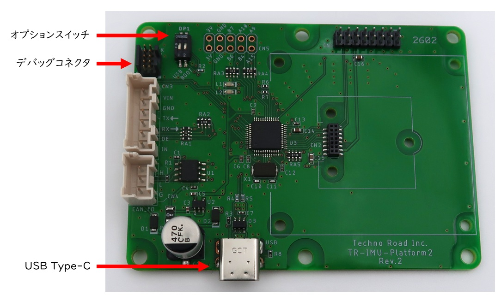
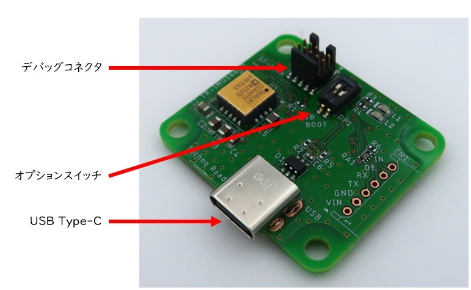
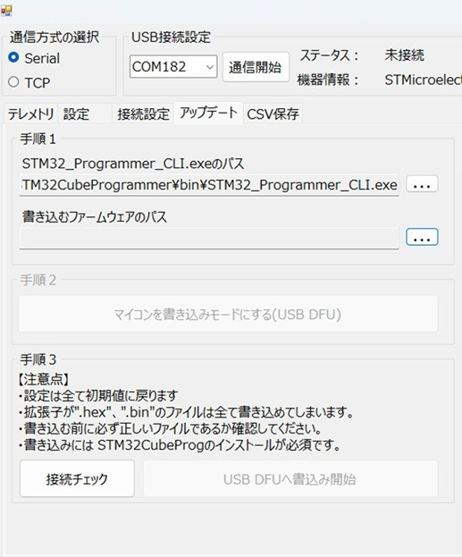
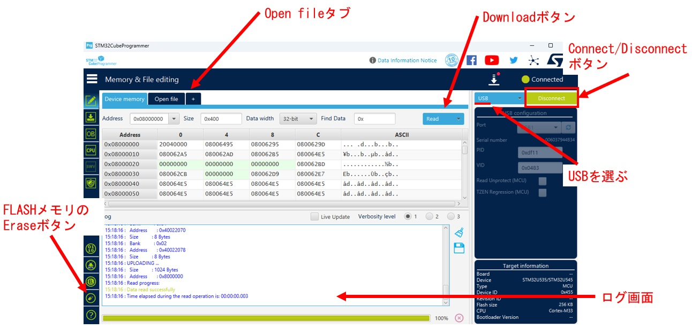

TR-IMU2基板共通　ファームウェアアップデートマニュアル

# 改訂履歴

| 版数 | 日付 | 変更内容 |
|---|---|---|
| 1 | 2026/06/30 | 新規作成 |

# はじめに

本書は、`TR-IMU-Platform2` および `TR-IMU16607` 共通のマニュアルです。  
このマニュアルではUSB通信のみでTR-IMU2基板へのファームウェアを書き込むまでの手順を記します。

## 基板
**TR-IMU2基板は同じマイコンかつ、同じピンアサインであるため共通のファームウェアで動作できます。**  
以下説明も共通の説明であります。  

### TR-IMU-Platform2

### TR-IMU16607

## 必要なもの
- <a href="https://www.st.com/ja/development-tools/stm32cubeprog.html">STM32CubeProg</a>
- <a href="https://github.com/technoroad/TR-IMU2-Monitor/releases/latest">弊社アプリ</a> (書き込みにはSTM32CubeProgが必須)
- <a href="https://github.com/technoroad/TR-IMU2-STM32/releases/latest">最新ファームウェア</a> (TR-IMU2基板共通)

## 弊社アプリで書き込む
以下の方法は書き込んだファームウェアが正常かつ、IMUがセットされている時のみ有効です。そうでない時は次のページの方法が必要です。

### 手順
1. アプリを起動してアップデートタブを開く
2. STM32CubeProgが正常インストールされていれば"STM32_programmer_CLI.exeのパス"にパスが自動で入る。
3. 書き込むファームウェアのパスを選択する。
4. アプリ上部の通信開始ボタンを押して書き込む基板とCOMで繋ぐ
5. 手順2の”マイコンを書き込みモードにする”ボタンを押す
6. 手順3の”接続チェック”ボタンを押す。
7. 正常なら”USB DFUへ書き込み開始”ボタンが押せる。
8. 完了したら右のログウィンドウに”書込み完了”と表示されます。

## STM32CubeProgで書き込む
前述の方法は書き込んだファームウェアが正常かつ、IMUがセットされている時のみ有効なのでそうでない時は以下の方法が必要です。

1. IMU基板の電源を切る
2. オプションスイッチの2番を上に傾けてOnにする
3. USBを入れてIMU基板の電源を入れる。
4. STM32CubeProgを起動する。
5. 青いプルダウンメニューで"USB"を選ぶ
6. Connectボタンを押して、マイコンと接続できれば青いログが流れ出す。
7. 画面左下の消しゴムマークでFLASHメモリを初期状態にリセットします。
8. 画面上部の”Open file”タブをクリックしてファームウェアを選びDownloadボタンを押す。
9. 完了されれば”File download complete”とポップアップが表示される。
10. オプションスイッチの2番を下に傾けてOffにする
11. 電源を入れ直すと書き込んだファームウェアが動きます。

---

Copyright (c) 2026 株式会社テクノロード
法令上認められる引用等を除き、当社の許可なく本資料の全部または一部を転載、複製、使用することはできません。

問い合わせ先
株式会社テクノロード
電話: 03-3440-6707
メール: post@techno-road.com
