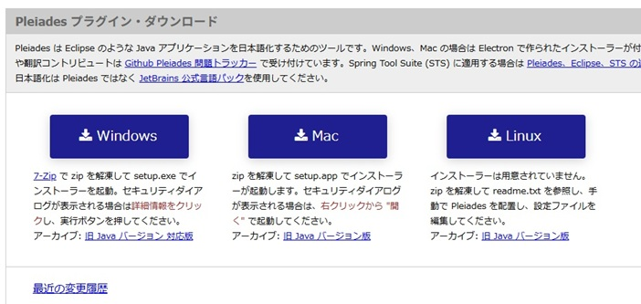
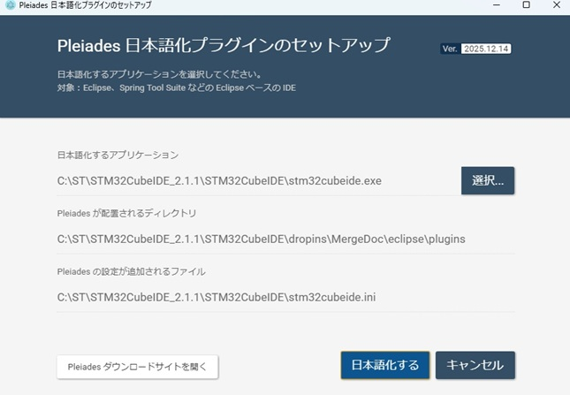
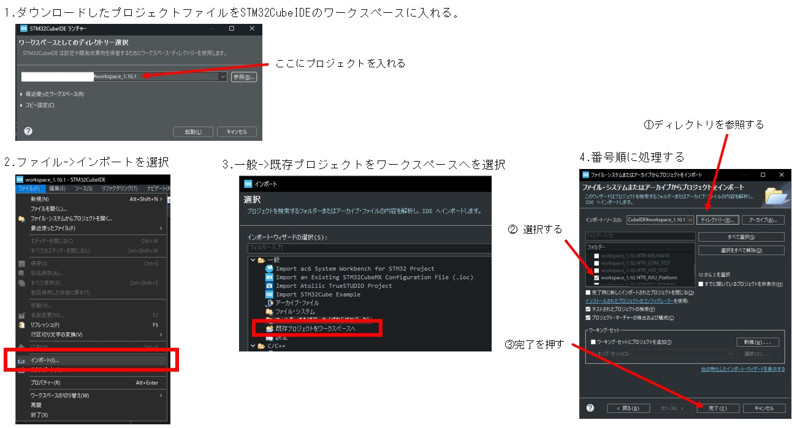

<div class="title" >TR-IMU2基板共通　ファームウェア開発マニュアル</div>

# 改訂履歴

| 版数 | 日付 | 変更内容 |
|---|---|---|
| 1 | 2026/06/30 | 新規作成 |

<div style="page-break-before:always"></div>

# はじめに

本書は、`TR-IMU-Platform2` および `TR-IMU16607` 共通のマニュアルです。  
このマニュアルではSTM32CubeIDEによるTR-IMU2基板のソフトウェア開発と基板にファームウェアを書き込むまでの手順を記します。

## 基板
TR-IMU2基板は同じマイコンかつ、同じピンアサインであるため共通のファームウェアで動作できます。  
以下説明も共通の説明であります。  

### TR-IMU-Platform2


<div style="page-break-before:always"></div>

### TR-IMU16607


<div style="page-break-before:always"></div>

# 開発環境のインストール

## STM32CubeIDEのインストール

### 手順
1. <a href="https://www.st.com/ja/development-tools/stm32cubeide.html">STM32CubeIDE</a> のページを開き、Windows版のインストーラをダウンロードします。  
2. ダウンロードしたインストーラを起動し、画面の指示に従ってインストールします。  
3. インストール途中でST-LINK関連のドライバやツールの導入確認が表示された場合は、そのままインストールします。  
4. インストール完了後、次の手順でSTM32CubeIDEを日本語化します。  

## STM32CubeIDEの日本語化

### 手順
1. <a href="https://willbrains.jp/">Pleiades</a> のサイトを開き、Windows版のPleiadesプラグインをダウンロードします。  
2. ダウンロードした圧縮ファイルを解凍します。  
3. 解凍したフォルダ内の `setup.exe` を実行します。  
4. 表示された画面で、STM32CubeIDEをインストールした場所の `.exe` ファイルを選択します。通常は `stm32cubeide.exe` を選択します。  
5. 「日本語化する」を実行します。  

### 参考画像　Pleiadesのダウンロード


### 参考画像　Pleiadesの日本語化


## 初回起動
1. 日本語化完了後、STM32CubeIDEを起動し、ワークスペースの保存先を設定します。  
2. STM32CubeIDEが起動できれば、開発環境の準備は完了です。  

# STM32CubeIDEでコーディングを行う  

## 必要なもの
- <a href="https://akizukidenshi.com/catalog/g/g114361/">STLINK-V3SET</a> (書き込みに必要)
- <a href="https://www.st.com/ja/development-tools/stm32cubeide.html">STM32CubeIDE</a> (開発環境)
- <a href="https://github.com/technoroad/TR-IMU2-STM32">IMU基板のプロジェクトファイル</a> (TR-IMU2基板共通)

## STM32CubeIDEでプロジェクトのインポート方法

### 手順

1. Eclipseのワークスペースにダウンロードしたプロジェクトファイルを入れる  
2. 「ファイル」→「インポート」を選択  
3. 「一般」→「既存プロジェクトをワークスペースへ」を選択  
4. 以下の順で処理する  
   - ① ディレクトリを参照する  
   - ② プロジェクトを選択する  
   - ③ 「完了」を押す  

### 参考画像


## プロジェクト構成
プロジェクトのディレクトリ構造を以下に示します。
主に変更するファイルは"User"ディレクトリにまとめて入っています。  
```
    TR-IMU2-STM32
    ├─ Debug                   # デバッグビルド出力
    ├─ Core                    # メイン処理（main, 割り込み, 初期化など）
    ├─ Drivers                 # HAL/LLなどのドライバ
    ├─ STM32_USB_Device_Library # USBデバイス用ライブラリ
    ├─ USB_Device              # USB設定・クラス実装
    ├─ User                    # ユーザ実装コード
    │   ├─ app                  # アプリケーション層
    │   ├─ communication        # 通信処理（コマンドの送信・受信処理など）
    │   ├─ filter               # 姿勢推定フィルタ（IMU補正・姿勢推定など）
    │   ├─ hardware             # ハード依存処理（GPIO, SPI, UART, USBなど）
    │   ├─ imu                  # IMU関連
    │   └─ option               # 設定・オプション系
    ├─ STM32U535CCTX_FLASH.ld  # フラッシュ用リンカスクリプト
    ├─ TR-IMU-Platform2.ioc    # CubeMX設定ファイル
    └─ TR-IMU-Platform2.launch # デバッグ起動設定
```

## 開発環境による書き込み方法
### 準備
開発環境から書き込むにはSTLINK-V3SETが必須になります。
MIPI-10デバッグコネクタとSTLINK-V3を繋いで、本基板とSTLINK-V3両方をUSBでPCと接続します。

### 手順
1. プロジェクトを右クリックして「プロジェクトのビルド」でビルドします。
2. ビルド後もう一度、右クリックして「実行」の「STM32 C/C++ Application」で書き込みをじっこうします。または「デバッグ」を選択するとデバッグが可能です。
3. 画面下部のコンソール出力に"Download verified successfully"と出れば書込み成功です。

<div style="page-break-before:always"></div>

# USB通信のみで書き込む方法
以下の方法ではSTLINK-V3なしでファームウェアを書き込めますが、デバッグができないので開発者向きではありません。

## 必要なもの
- <a href="https://www.st.com/ja/development-tools/stm32cubeprog.html">STM32CubeProg</a>
- <a href="https://github.com/technoroad/TR-IMU2-Monitor/releases">弊社アプリ</a> (書き込みにはSTM32CubeProgが必須)
- <a href="https://github.com/technoroad/TR-IMU2-STM32/releases/latest">最新ファームウェア</a> (TR-IMU2基板共通)

## 弊社アプリで書き込む
以下の方法は書き込んだファームウェアが正常かつ、IMUがセットされている時のみ有効です。そうでない時は次のページの方法が必要です。

### 手順
1. アプリを起動してアップデートタブを開く
2. STM32CubeProgが正常インストールされていれば"STM32_programmer_CLI.exeのパス"にパスが自動で入る。
3. 書き込むファームウェアのパスを選択する。
4. アプリ上部の通信開始ボタンを押して書き込む基板とCOMで繋ぐ
5. 手順2の”マイコンを書き込みモードにする”ボタンを押す
6. 手順3の”接続チェック”ボタンを押す。
7. 正常なら”USB DFUへ書き込み開始”ボタンが押せる。
8. 完了したら右のログウィンドウに”書込み完了”と表示されます。


<div style="page-break-before:always"></div>

## STM32CubeProgで書き込む
前述の方法は書き込んだファームウェアが正常かつ、IMUがセットされている時のみ有効なのでそうでない時は以下の方法が必要です。

1. IMU基板の電源を切る
2. オプションスイッチの2番を上に傾けてOnにする
3. USBを入れてIMU基板の電源を入れる。
4. STM32CubeProgを起動する。
5. 青いプルダウンメニューで"USB"を選ぶ
6. Connectボタンを押して、マイコンと接続できれば青いログが流れ出す。
7. 画面左下の消しゴムマークでFLASHメモリを初期状態にリセットします。
8. 画面上部の”Open file”タブをクリックしてファームウェアを選びDownloadボタンを押す。
9. 完了されれば”File download complete”とポップアップが表示される。
10. オプションスイッチの2番を下に傾けてOffにする
11. 電源を入れ直すと書き込んだファームウェアが動きます。


---

Copyright (c) 2026 株式会社テクノロード
法令上認められる引用等を除き、当社の許可なく本資料の全部または一部を転載、複製、使用することはできません。

問い合わせ先
株式会社テクノロード
電話: 03-3440-6707
メール: post@techno-road.com
