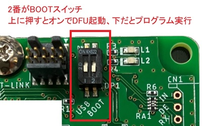

TR-IMU2基板共通 初回動作確認書

# 改訂履歴

| 版数 | 日付 | 変更内容 |
|---|---|---|
| 1 | 2026/07/03 | 新規作成 |

# はじめに

本書は、`TR-IMU-Platform2` または `TR-IMU16607` を初めて使用する方が、購入直後に最低限の動作確認を行うための資料です。

詳しい使い方、設定変更、通信仕様、開発方法は、後述の関連資料を参照してください。

## 使用前の注意

本製品は評価・研究開発用途を想定しています。使用前に、各製品のハードウェアマニュアルに記載されている取り扱い上の注意および保証条件を確認してください。

# DIPスイッチの確認

動作確認を始める前に、DIPスイッチの設定を確認してください。
2番スイッチ `BOOT` が `ON` になっていると、基板はプログラム書き込みモードで起動するため、通常の動作確認は行えません。`BOOT` が `OFF` になっていることを確認してください。

# 確認の流れ

## TR-IMU16607 の場合

`TR-IMU16607` は IMU が基板に実装済みです。

1. PC と `TR-IMU16607` を USB Type-C ケーブルで接続します。
2. C# アプリ `TR-IMU2-Monitor` を起動します。
3. COM ポートを選択して接続し、データが更新されることを確認します。

## TR-IMU-Platform2 の場合

`TR-IMU-Platform2` は、IMU を別途取り付けてから使用します。

1. 使用する IMU に合わせて、次のどちらかの取り付けマニュアルを参照します。
   - 評価ボードを使用する場合: [TR-IMU-Platform2_取り付けマニュアル_評価ボード.md](./TR-IMU-Platform2_取り付けマニュアル_評価ボード.md)
   - `ADIS16575-2` を使用する場合: [TR-IMU-Platform2_取り付けマニュアル_ADIS16575.md](./TR-IMU-Platform2_取り付けマニュアル_ADIS16575.md)
2. IMU を取り付けたあと、PC と `TR-IMU-Platform2` を USB Type-C ケーブルで接続します。
3. C# アプリ `TR-IMU2-Monitor` を起動します。
4. COM ポートを選択して接続し、データが更新されることを確認します。

# C# アプリでの確認(Windows PCのみ)

## アプリの入手

C# アプリ `TR-IMU2-Monitor` は、以下から入手できます。

- [Windows用テストアプリ - technoroad/TR-IMU2-Monitor](https://github.com/technoroad/TR-IMU2-Monitor/releases/latest)

## 最小確認手順

1. 基板を PC に接続します。
2. `TR-IMU2-Monitor` を起動します。
3. COM ポートを選択します。
4. `通信開始` を押します。
5. `データの取得開始` を押します。
6. 数値表示が更新されること、または 3D 表示が姿勢に追従することを確認します。

上記が確認できれば、初回の動作確認は完了です。

もう少し詳しい操作方法は [TR-IMU2基板共通_アプリケーションマニュアル.md](./TR-IMU2基板共通_アプリケーションマニュアル.md) を参照してください。

# Python アプリでの確認(Linux PC)

Linux PC では、Python アプリ `TR-IMU2-PythonTestApp` を使って動作確認できます。

1. Python の実行環境を用意します。
2. 必要に応じて `pyserial` などのライブラリをインストールします。
3. USB 接続で確認する場合は、`/dev/ttyACM0` などのポートを指定して `imu_platform2_usbserial_test.py` を実行します。
4. 3D 表示で確認する場合は、`imu_platform2_usbserial_cube_viewer.py` を実行します。

`TR-IMU-Platform2` は、Linux の `SocketCAN` を使用して `CAN FD` で確認することもできます。

詳しい手順は [Pythonテストアプリ - technoroad/TR-IMU2-PythonTestApp](https://github.com/technoroad/TR-IMU2-PythonTestApp) を参照してください。

# うまく動作しない場合

- COM ポートが表示されない場合は、USB ケーブル、PC 側の認識状態、基板の電源状態を確認してください。
- 基板が起動しない、または動作確認できない場合は、DIPスイッチの `BOOT` が `OFF` になっていることを確認してください。
- `TR-IMU-Platform2` でデータが取得できない場合は、IMU の取り付け状態を確認してください。
- アプリの操作や設定で迷った場合は、アプリケーションマニュアルを参照してください。
- ハードウェア仕様やコネクタ位置を確認したい場合は、各ハードウェアマニュアルを参照してください。

# 関連資料

## 使用方法・アプリ操作

- [TR-IMU2基板共通_アプリケーションマニュアル.md](./TR-IMU2基板共通_アプリケーションマニュアル.md)

## TR-IMU-Platform2 の取り付け

- [TR-IMU-Platform2_取り付けマニュアル_評価ボード.md](./TR-IMU-Platform2_取り付けマニュアル_評価ボード.md)
- [TR-IMU-Platform2_取り付けマニュアル_ADIS16575.md](./TR-IMU-Platform2_取り付けマニュアル_ADIS16575.md)

## ハードウェア仕様

- [TR-IMU-Platform2_ハードウェアマニュアル.md](./TR-IMU-Platform2_ハードウェアマニュアル.md)
- [TR-IMU16607_ハードウェアマニュアル.md](./TR-IMU16607_ハードウェアマニュアル.md)

## 通信仕様・開発

- [TR-IMU-Platform2_CANFD通信仕様書.md](./TR-IMU-Platform2_CANFD通信仕様書.md)
- [TR-IMU2基板共通_USB,UART通信仕様書.md](./TR-IMU2基板共通_USB,UART通信仕様書.md)
- [TR-IMU2基板共通_ファームウェア開発マニュアル.md](./TR-IMU2基板共通_ファームウェア開発マニュアル.md)
- [TR-IMU2基板共通_ファームウェアアップデートマニュアル.md](./TR-IMU2基板共通_ファームウェアアップデートマニュアル.md)
- [W55RP20-S2Eを用いたTR-IMU2基板TCP通信マニュアル.md](./W55RP20-S2Eを用いたTR-IMU2基板TCP通信マニュアル.md)

---

Copyright (c) 2026 株式会社テクノロード
法令上認められる引用等を除き、当社の許可なく本資料の全部または一部を転載、複製、使用することはできません。

問い合わせ先
株式会社テクノロード
電話: 03-3440-6707
メール: post@techno-road.com
