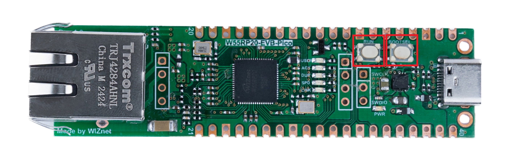
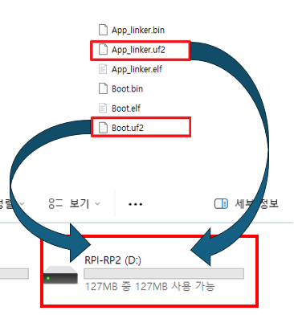
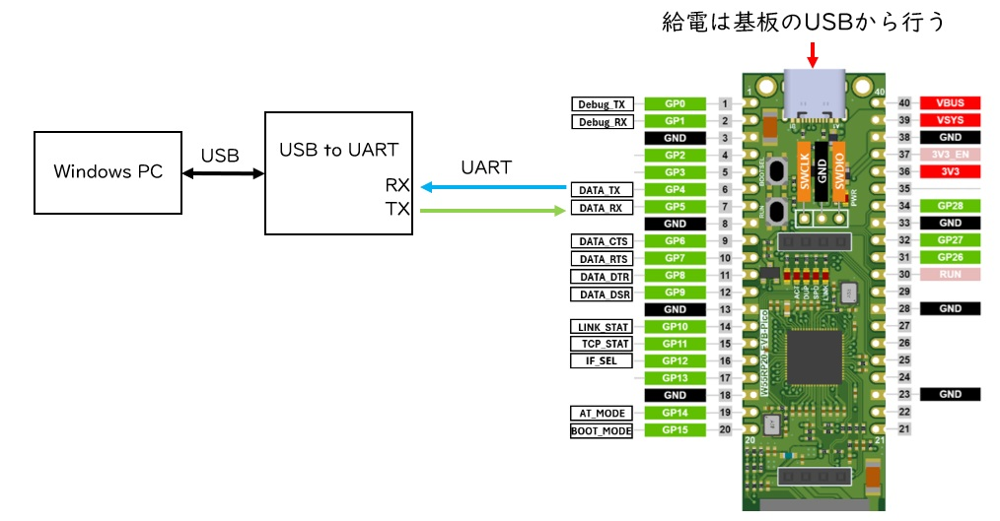
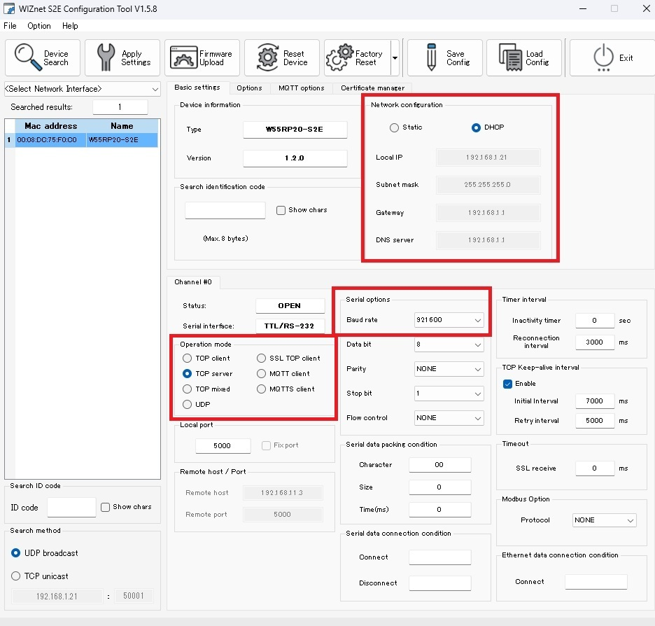
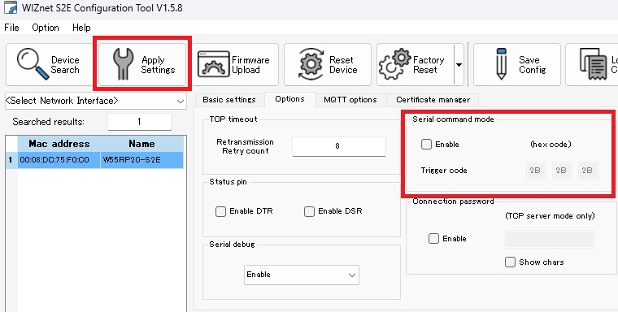
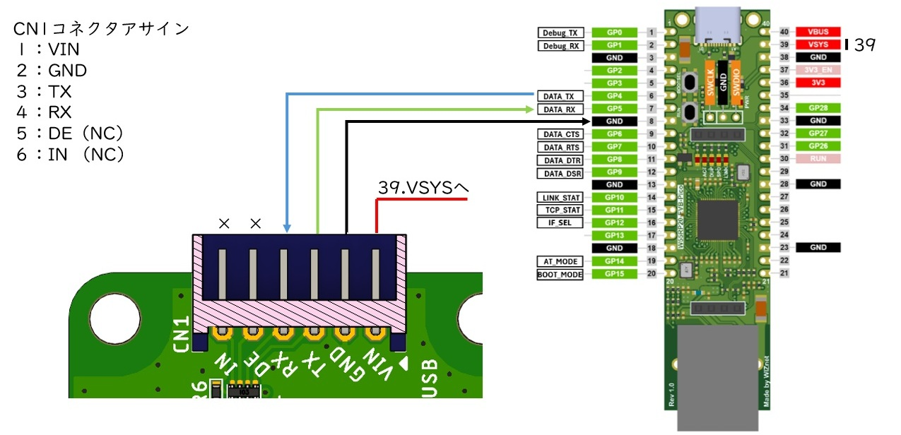
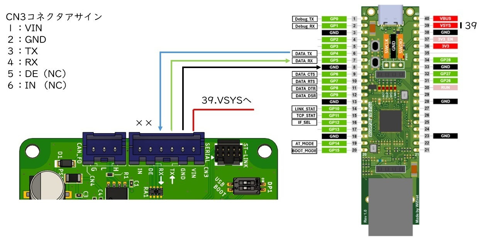
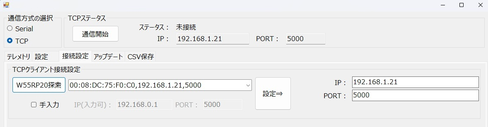

W55RP20-S2Eを用いたTR-IMU2基板TCP通信マニュアル

# 改訂履歴

| 版数 | 日付 | 変更内容 |
|---|---|---|
| 1 | 2026/06/30 | 新規作成 |

# はじめに

本書は、`W55RP20-EVB-PICO` に `W55RP20-S2E` ファームウェアを書き込み、`TR-IMU-Platform2` または `TR-IMU16607` と `UART` で接続し、上位PCから `TCP` 経由で通信するまでの手順をまとめたマニュアルです。  

上位PCでの評価には、弊社が公開している Windows 用 C# アプリ `TR-IMU2-Monitor` を使用します。アプリ全体の基本的な使い方は `TR-IMU2基板共通_アプリケーションマニュアル.md` を参照してください。本書では、`W55RP20` を用いて `TCP` 接続するために必要な手順に絞って説明します。

## 本書の対象

- `TR-IMU-Platform2`もしくは、`TR-IMU16607`
- [Windows用テストアプリ - technoroad/TR-IMU2-Monitor](https://github.com/technoroad/TR-IMU2-Monitor)
- `W55RP20-EVB-PICO`（他社品）

## 関連資料
- [TR-IMU2基板共通_アプリケーションマニュアル.md](./TR-IMU2基板共通_アプリケーションマニュアル.md)
- [TR-IMU-Platform2_ハードウェアマニュアル.md](./TR-IMU-Platform2_ハードウェアマニュアル.md)
- [TR-IMU16607_ハードウェアマニュアル.md](./TR-IMU16607_ハードウェアマニュアル.md)

## Wiznet関連資料
- [W55RP20-S2E Getting Started](https://github.com/Wiznet/document_framework/blob/master/docs/Product/Chip/MCU/Pre-programmed-MCU/W55RP20-S2E/w55rp20-evb-pico-s2e-jp.md?plain=1)
- [W55RP20-S2E Releases](https://github.com/WIZnet-ioNIC/W55RP20-S2E/releases)
- [WIZnet S2E Configuration Tool Releases](https://github.com/Wiznet/WIZnet-S2E-Tool-GUI/releases)
- [WIZMacTool](https://docs.wiznet.io/img/products/wiz750sr/developers/restore-mac/wizmactool_v20151127.zip)

# 準備するもの

## ハードウェア

- `TR-IMU-Platform2` または `TR-IMU16607`
- `USB Type-C` ケーブル（ご購入時の付属品）
- `Ethernet` ケーブル（他社品）
- [W55RP20-EVB-PICO](https://akizukidenshi.com/catalog/g/g130213/)（他社品）
- [USBシリアル変換モジュール](https://akizukidenshi.com/catalog/g/g108461/) **(他社品、要はんだ付け)**
- `UART` 配線用ケーブル **（他社品、部品の購入とケーブルの加工が必要）** 
- Windows PC

## ソフトウェア(Windows PC専用)

- `W55RP20-S2E`
- `WIZMacTool`
- `WIZnet S2E Configuration Tool`
- `TR-IMU2-Monitor`

## 通信構成

本書では、以下の構成で通信します。

`上位PC` ←→ `Ethernet` ←→ `W55RP20-S2E` ←→ `UART` ←→ `TR-IMU2基板`

この構成では、`W55RP20` 側を `TCP Server`、`TR-IMU2-Monitor` 側を `TCP Client` として使用します。

# W55RP20へS2Eを書き込む

## ファームウェアの入手

`W55RP20-S2E` の最新リリースを以下からダウンロードします。

`https://github.com/WIZnet-ioNIC/W55RP20-S2E/releases`

ダウンロードした `W55RP20-S2E_Bin_Files_VXXX.zip` を解凍し、`Boot.uf2` と `App_linker.uf2` を使用します。

## 書き込み手順

1. `W55RP20-EVB-PICO` を USB で PC に接続します。
2. 基板上の `BOOTSEL` ボタンを押しながら、隣の `RUN` ボタンを一度短く押します。

3. PC に `RPI-RP2` というリムーバブルディスクが表示されることを確認します。
4. 解凍した `W55RP20-S2E_Bin_Files_VXXX` フォルダから `Boot.uf2` と `App_linker.uf2` を 1つずつドラッグアンドドロップします。

5. 最初のファイルを書き込んだあとに `RPI-RP2` ドライブが消える場合があります。その場合は、再度 `BOOTSEL` モードに入ってから、残りの `uf2` ファイルを書き込んでください。

より詳しい手順は、WIZnet 公式資料を参照してください。  
`https://docs.wiznet.io/Product/Chip/MCU/Pre-programmed-MCU/W55RP20-S2E/w55rp20-evb-pico-s2e-jp`

## MACアドレスの書き込み

### USBシリアル変換モジュールの配線
**MACアドレスはW55RP20-EVB-PICOのUSB type-Cコネクタから書き込めません。**
MACアドレスを書き込むには、USBシリアル変換モジュールを使用して、`W55RP20-EVB-PICO` の `UART` に接続する必要があります。
以下の図を参考に、USBシリアル変換モジュールと `W55RP20-EVB-PICO` を接続してください。

### MACアドレスの書き込みツールの入手
`WIZMacTool` を以下からダウンロードします。
`https://docs.wiznet.io/Product/Chip/MCU/Pre-programmed-MCU/W55RP20-S2E/mac_address-write-guide-jp`

### MACアドレスの書き込み手順
以下ページを参考にして、`WIZMacTool` を使用して MACアドレスを書き込んでください。
`https://docs.wiznet.io/Product/Chip/MCU/Pre-programmed-MCU/W55RP20-S2E/mac_address-write-guide-jp`

# S2Eを設定する

## 設定ツールの入手

`WIZnet S2E Configuration Tool` を以下からダウンロードします。

`https://github.com/Wiznet/WIZnet-S2E-Tool-GUI/releases`

## 設定方針

本書では、上位PCの `TR-IMU2-Monitor` を `TCP Client` として使用するため、`W55RP20` 側は `TCP Server` として設定します。

また、`TR-IMU2基板` の `UART` 通信条件は `921600 bps`、`8N1` です。  
そのため、`W55RP20-S2E` のシリアル設定も同じ条件に合わせる必要があります。

## 最低限必要な設定

1. `W55RP20-EVB-PICO` を Ethernet に接続し、設定ツールで対象デバイスを検索します。
2. 検索結果から対象の `W55RP20` を選択します。

### Basic settings タブ

`Basic settings` タブでは、少なくとも以下を設定します。

- `Network configuration`
  - 固定IPで使用する場合は `Static` を選択し、`IPアドレス`、`Subnet mask`、`Gateway`、`DNS server` を入力します。
  - DHCPで使用する場合は `DHCP` を選択します。
- `Operation mode`
  - `TCP server` を選択します。
- `Serial options`
  - `Baud rate` を `921600` に設定します。
  - `Data bit`、`Parity`、`Stop bit` は `8N1` に合わせます。

本書の画面例では `DHCP` を選択し、TPCのポートはデフォルトのままで`Local port = 5000` の構成を使用しています。  
固定IPで使用する場合は、使用するネットワークに合わせて `Static` 側の値を設定してください。

### Options タブ

`Options` タブでは、`Serial command mode` の `Enable` チェックを外してください。

### 設定の反映

設定後は `Apply Settings` を実行し、必要に応じて再起動して設定を反映します。

# UART配線を接続する

以下の図は、`W55RP20` と `TR-IMU2基板` を接続する配線例です。  
`UART` は `TX` と `RX` を交差接続し、`GND` を共通化してください。

## TR-IMU16607 の配線

### 配線内容

| TR-IMU16607 CN1 | W55RP20-EVB-PICO | 内容 |
|---|---|---|
| `Pin 1` (`VIN`) | `VSYS` | 電源供給 |
| `Pin 2` (`GND`) | `GND` | グラウンド |
| `Pin 3` (`TX`) | `GP5` (`DATA_RX`) | TR-IMU16607 → W55RP20 |
| `Pin 4` (`RX`) | `GP4` (`DATA_TX`) | W55RP20 → TR-IMU16607 |
| `Pin 5` (`DE`) | `NC` | 未使用 |
| `Pin 6` (`IN`) | `NC` | 未使用 |

## TR-IMU-Platform2 の配線

### 配線内容

| TR-IMU-Platform2 CN3 | W55RP20-EVB-PICO | 内容 |
|---|---|---|
| `Pin 1` (`VIN`) | `VSYS` | 電源供給 |
| `Pin 2` (`GND`) | `GND` | グラウンド |
| `Pin 3` (`TX`) | `GP5` (`DATA_RX`) | TR-IMU-Platform2 → W55RP20 |
| `Pin 4` (`RX`) | `GP4` (`DATA_TX`) | W55RP20 → TR-IMU-Platform2 |
| `Pin 5` (`DE`) | `NC` | 未使用 |
| `Pin 6` (`IN`) | `NC` | 未使用 |

## 配線時の注意

- `UART` 通信条件は `921600 bps`、`8N1` です。
- `TX` と `RX` は必ず交差接続してください。
- `GND` は必ず接続してください。
- `TR-IMU-Platform2` は `CN3`、`TR-IMU16607` は `CN1` を使用してください。

# UART配線用ケーブル

`TR-IMU16607` と `TR-IMU-Platform2` では、基板側のコネクタシリーズが異なります。  
そのため、`UART` 配線用ケーブルは基板ごとに対応するハウジングとコンタクトを使用してください。

## TR-IMU16607 用

- 基板側コネクタ型番: `S6B-PH-K-S`
- ケーブル側ハウジング: [PHR-6](https://eleshop.jp/shop/g/g61K147/)
- ケーブル側コンタクト: [BPH-002T-P0.5S](https://eleshop.jp/shop/g/g61K142/)

`TR-IMU16607` 側は `PH` シリーズの `6極 / 2.0mmピッチ` です。

圧着済みのコードを使う場合は、以下の `PHコンタクトピン付コード` も使用できます。

- [日圧PHコンタクトピン付コード赤 L-40cm / 311-539-1](https://eleshop.jp/shop/g/gEAO311/)

このコードは `BPH-002T-P0.5S` が片端に圧着済みです。必要本数を `PHR-6` ハウジングへ挿入してケーブルを作れます。  
色は `赤` のみでも可能ですが、安全策として`白`、`黄`、`黒` も使用するのが望ましいです。

## TR-IMU-Platform2 用

- 基板側コネクタ型番: `B06B-XASK-1`
- ケーブル側ハウジング: [XAP-06V-1](https://eleshop.jp/shop/g/gG93125/)
- ケーブル側コンタクト: [BXA-001T-P0.6](https://eleshop.jp/shop/g/gG9312A/)

`TR-IMU-Platform2` 側は `XA` シリーズの `6極 / 2.5mmピッチ` です。

- [XAメスコンタクトピン付コード 赤 10本組 / ASM-XA-RD10](https://eleshop.jp/shop/g/gL3J129/)

このコードは `BXA-001T-P0.6` が片端に圧着済みなので、`XAP-06V-1` ハウジングへ必要本数を挿入してケーブルを作りやすくなります。
色は `赤` のみでも可能ですが、安全策として`白`、`黄`、`黒` も使用するのが望ましいです。

# C#アプリでTCP接続する

## 使用するアプリ

上位PCでは、Windows 用 C# アプリ `TR-IMU2-Monitor` を使用します。  
アプリの基本的な使い方は `TR-IMU2基板共通_アプリケーションマニュアル.md` を参照してください。ここでは、`TCP` 接続時の設定差分のみ説明します。

`TCP` 通信時の給電は、`W55RP20-EVB-PICO` の `USB Type-C` コネクタへ USB を接続して行ってください。

## 接続設定タブでTCP設定を行う

1. `TR-IMU2-Monitor` を起動します。
2. `接続設定` タブを開きます。
3. `W55RP20探索` ボタンを押します。
4. 検出された `W55RP20` が自動で選択されたら、必要に応じて `設定=>` で `IP` と `PORT` を反映します。
5. 手動で設定する場合は `手入力` を有効にし、`IP` と `PORT` を直接入力します。

`W55RP20探索` が利用できる場合は自動選択を使用し、探索で見つからない場合は手入力で設定してください。

## 通信を開始する

1. 画面左上の `通信方式の選択` で `TCP` を選択します。
2. `通信開始` ボタンを押します。
3. `TCPステータス` が接続状態に変わることを確認します。

接続できない場合は、`W55RP20` の `IP`、`PORT`、`TCP Server` 設定、および PC と `W55RP20` のネットワーク接続を確認してください。

## テレメトリを取得する

`TCP` 接続後は、`TR-IMU2基板共通_アプリケーションマニュアル.md` の基本操作と同様にデータ取得を行います。

1. `テレメトリ` タブを表示します。
2. `データの取得開始` ボタンを押します。
3. 加速度、角速度、姿勢データが更新されることを確認します。

停止する場合は、通常の操作と同様に停止ボタンを使用してください。

# トラブルシュート

## W55RP20探索で見つからない

- `W55RP20` に電源が入っているか確認してください。
- `Ethernet` ケーブルが正しく接続されているか確認してください。
- PC と `W55RP20` が同一ネットワークに接続されているか確認してください。
- 見つからない場合は、`手入力` で `IP` と `PORT` を直接設定してください。

## TCP接続できない

- `W55RP20` が `TCP Server` で設定されているか確認してください。
- `PORT` 番号が `W55RP20` と `TR-IMU2-Monitor` で一致しているか確認してください。
- `Serial Options` の `Baud Rate` が `921600` になっているか確認してください。
- `UART` 配線の `TX`、`RX`、`GND` が正しいか確認してください。

## 接続できてもデータが出ない

- `テレメトリ` タブで `データの取得開始` を押しているか確認してください。
- `TR-IMU-Platform2` または `TR-IMU16607` が正常起動しているか確認してください。
- `TR-IMU2基板共通_アプリケーションマニュアル.md` を参照し、通常のアプリ操作で問題がないか確認してください。

